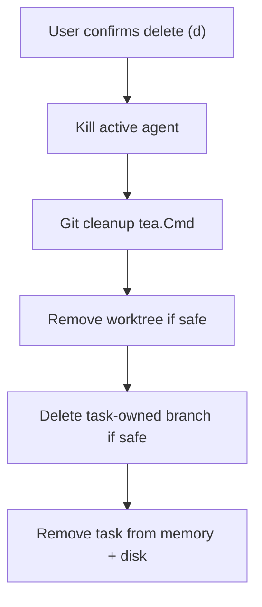

# Delete Task: Remove Worktrees and Feature Branches

yippee

BOOP

## Current behavior (gap)

Pressing `d` opens a confirmation modal, then [`deleteTask`](internal/ui/app.go) runs:

beeep boop bap

1. Kills any live agent process for the task
2. Removes the task from the in-memory list
3. Calls [`store.DeleteTask`](internal/store/store.go) (task JSON, log, raw stdout/stderr, offset)

**No git cleanup happens today.** Worktrees at `<repo>/.claude/worktrees/<branch-with-slashes-as-dashes>` and feature branches (typically `feat/<DisplayID>`, e.g. `feat/CORMAKE-36`) are left behind.

By contrast, **Mark Complete** ([`completeTaskCmd`](internal/ui/complete.go)) already knows how to commit outstanding changes, unlock, and `git worktree remove` — but intentionally **keeps** the branch.



beep

## Task ↔ git association (what to clean up)

From [`domain.Task`](internal/domain/task.go) and [`resolveTaskWorktree`](internal/ui/app.go):

| Field | Meaning |
|---|---|
| `TargetBranch` | Branch the task commits to (wizard default: `feat/<DisplayID>` via [`suggestTargetBranchName`](internal/ui/branches.go)) |
| `WorktreePath` | Absolute path set on first Plan/Execute run |
| `WorktreeName` | Branch name recorded on the task (usually same as `TargetBranch`) |
| `Branch` | Set only after Complete; worktree already removed |

**Resolve branch name** (same fallback chain as [`startCompleteTask`](internal/ui/app.go)):

```go
branch := t.TargetBranch
if branch == "" {
    branch = t.WorktreeName
}
if branch == "" {
    branch = worktreeName(t) // legacy: "acme-7"
}
```

**Worktree path**: prefer `t.WorktreePath`; if empty but branch is known, fall back to [`findWorktreeForBranch`](internal/ui/branches.go).

## Proposed cleanup rules (defaults — acceptance criteria were empty)

These follow the task title ("associated feature branches") and existing codebase safety patterns:

### 1. Worktree removal

- Remove the worktree **only if no other task in the workspace still references it** (same `WorktreePath`, or same resolved branch name).
- **Discard uncommitted changes** — use `git worktree remove --force` after best-effort `git worktree unlock` (mirror [`completeTaskCmd`](internal/ui/complete.go), but with `--force` since delete is abandon-not-finalize).
- Skip worktree removal if `WorktreePath` is empty and no worktree exists for the branch (e.g. TODO task never run, or already completed).

### 2. Branch deletion

- Delete the branch **only if it is task-owned**, i.e. matches one of:
  - `feat/<DisplayID>` ([`suggestTargetBranchName`](internal/ui/branches.go))
  - legacy `worktreeName(t)` (lowercased display id, e.g. `acme-7`)
- **Do not delete** branches the user explicitly picked from an existing list (e.g. `develop`, `main`) — those are not "associated feature branches."
- Skip branch deletion if another remaining task shares the same resolved branch name.
- Use `git branch -D <branch>` from the repo root (force-delete is appropriate for abandoned task branches).
- Apply even when `WorktreePath` is already empty (completed tasks still leave the feature branch behind today).

### 3. Error handling

- Git cleanup is **best-effort**: failures are logged to stderr (`cormake: failed to clean up git for task …`) but the task record is still deleted (consistent with [`DeleteTask`](internal/store/store.go)'s best-effort log cleanup).
- Update the delete confirmation copy to set expectations: e.g. *"Delete …? This removes the task and any associated worktree/branch. This cannot be undone."*

### 4. No repo assigned

- If the task has no `RepoID` / repo path, skip git cleanup entirely (same guard as Plan/Execute).

## Implementation plan

### Step 1 — Extract shared git helpers

Add to [`internal/ui/branches.go`](internal/ui/branches.go) (or a small new [`internal/ui/gitcleanup.go`](internal/ui/gitcleanup.go)):

- `taskBranch(t domain.Task) string` — resolve branch with fallback chain above
- `isTaskOwnedBranch(branch string, t domain.Task) bool` — matches suggested or legacy names
- `otherTasksShareBranch(tasks []domain.Task, excludeID, branch, worktreePath string) bool`
- `removeWorktreeForce(repoPath, worktreePath string) error` — unlock + `worktree remove --force`
- `deleteLocalBranch(repoPath, branch string) error` — `git branch -D`

Refactor [`completeTaskCmd`](internal/ui/complete.go) to call `removeWorktreeForce` **without** `--force` (complete commits first, so force isn't needed) — or keep complete's non-force remove and only use `--force` in the delete path to avoid behavior change on Complete.

### Step 2 — Add async delete command

Add `deleteTaskCmd(task domain.Task, repoPath string, allTasks []domain.Task) tea.Cmd` alongside complete helpers:

```go
func deleteTaskCmd(task domain.Task, repoPath string, allTasks []domain.Task) tea.Cmd {
    return func() tea.Msg {
        branch := taskBranch(task)
        worktreePath := task.WorktreePath
        if worktreePath == "" && branch != "" {
            worktreePath, _ = findWorktreeForBranch(repoPath, branch)
        }
        shared := otherTasksShareBranch(allTasks, task.ID, branch, worktreePath)
        var err error
        if worktreePath != "" && !shared {
            err = removeWorktreeForce(repoPath, worktreePath)
        }
        if err == nil && branch != "" && isTaskOwnedBranch(branch, task) && !shared {
            if branchErr := deleteLocalBranch(repoPath, branch); branchErr != nil {
                err = branchErr
            }
        }
        return deleteFinishedMsg{taskID: task.ID, err: err}
    }
}
```

Add `deleteFinishedMsg` handler in [`app.go`](internal/ui/app.go) `Update` — on receipt, call the existing in-memory/disk removal logic (currently in `deleteTask`).

### Step 3 — Rewire confirmation flow

In [`updateConfirmModal`](internal/ui/app.go) for `confirmKindDelete`:

1. Resolve the task by `confirmTaskID` (same pattern as `startCompleteTask`)
2. Dispatch `deleteTaskCmd` instead of calling `deleteTask` synchronously
3. `deleteFinishedMsg` handler calls `deleteTask(id)` for store/memory cleanup; log `msg.err` if non-nil

Keep the agent-kill logic in `deleteTask` (or move it to the confirm handler before dispatching the cmd — agent should die immediately, not after async git work).

### Step 4 — Tests

Add [`internal/ui/gitcleanup_test.go`](internal/ui/gitcleanup_test.go) (unit tests, no real git required):

- `taskBranch` fallback chain (TargetBranch → WorktreeName → worktreeName)
- `isTaskOwnedBranch` true for `feat/ACME-7` and `acme-7`, false for `develop`
- `otherTasksShareBranch` detects shared branch/path, ignores deleted task ID

Add integration-style test with a temp git repo (optional but valuable):

- Init repo, create branch + worktree via existing `createWorktree`
- Run cleanup helpers directly
- Assert worktree dir gone and branch deleted

Follow existing test style in [`internal/ui/app_test.go`](internal/ui/app_test.go) and [`internal/store/store_test.go`](internal/store/store_test.go).

## Files to touch

| File | Change |
|---|---|
| [`internal/ui/branches.go`](internal/ui/branches.go) | Branch resolution, ownership check, shared-task guard, branch delete helper |
| [`internal/ui/complete.go`](internal/ui/complete.go) or new `gitcleanup.go` | Worktree force-remove helper |
| [`internal/ui/app.go`](internal/ui/app.go) | Async delete cmd, message handler, updated confirm text, kill-before-cleanup ordering |
| `internal/ui/gitcleanup_test.go` | Unit tests for new helpers |

## Manual test plan

1. Create task → Plan/Execute → verify worktree at `.claude/worktrees/feat-<ID>` → delete → worktree dir and `feat/<ID>` branch gone
2. Create task on existing branch `develop` → delete → worktree removed (if exclusive), `develop` branch **remains**
3. Two tasks sharing same target branch → delete one → worktree and branch **remain**; delete both → cleaned up
4. Completed task (no worktree) → delete → feature branch removed
5. TODO task never executed (branch may not exist) → delete succeeds with no git errors
6. Delete while agent running → process killed, worktree removed

## Out of scope (unless you want to expand)

- Tracking whether a branch was user-picked vs auto-created in the task model (heuristic above avoids schema change)
- Remote branch cleanup (`git push origin --delete`)
- Pruning empty `.claude/worktrees/` parent directories
- Blocking delete on git cleanup failure (proposed: best-effort)

## Implementation todos

- [ ] Add taskBranch, isTaskOwnedBranch, otherTasksShareBranch, removeWorktreeForce, deleteLocalBranch helpers
- [ ] Implement deleteTaskCmd + deleteFinishedMsg; wire into confirm modal and Update handler
- [ ] Update delete confirmation message to mention worktree/branch removal
- [ ] Add unit tests for branch resolution, ownership, shared-task guard; optional temp-repo integration test
